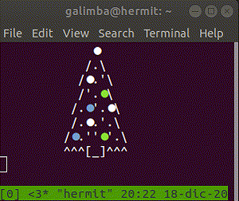

# christmasTree

## Simple Christmas tree made in python, inspired by Engineer Man
This digital Christmas tree is more sustainable than the ones you used to cut down from the woods!
It is also customizable:
* `tree.txt` is a template
* `tree2.txt` replace R,G,B or Y for colloring Red, Green, Blue or Star(Yellow)
* `tree3.txt` different ASCII tree model

## To run simply make the script executable and run:
```python
chmod +x tree.py
./tree.py
```
I ussually run it in crontab, with a stay-on-top resized window moved to the edge of the screen, to decorate my desktop

